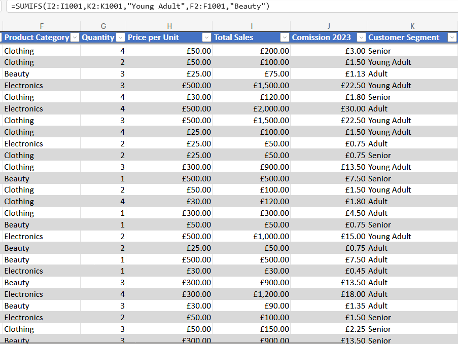
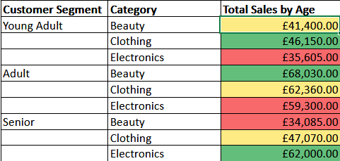
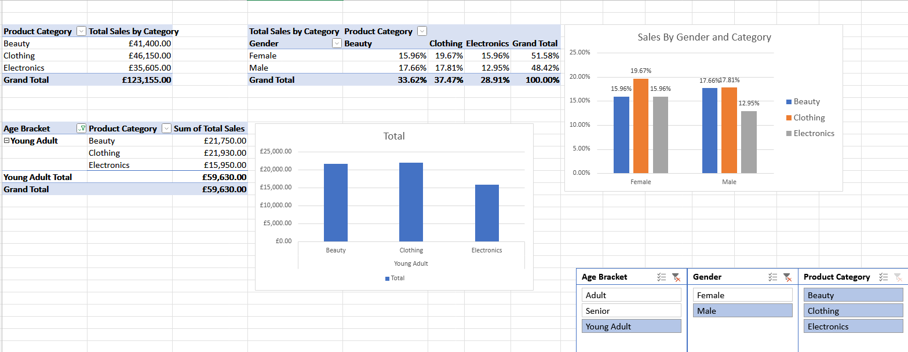
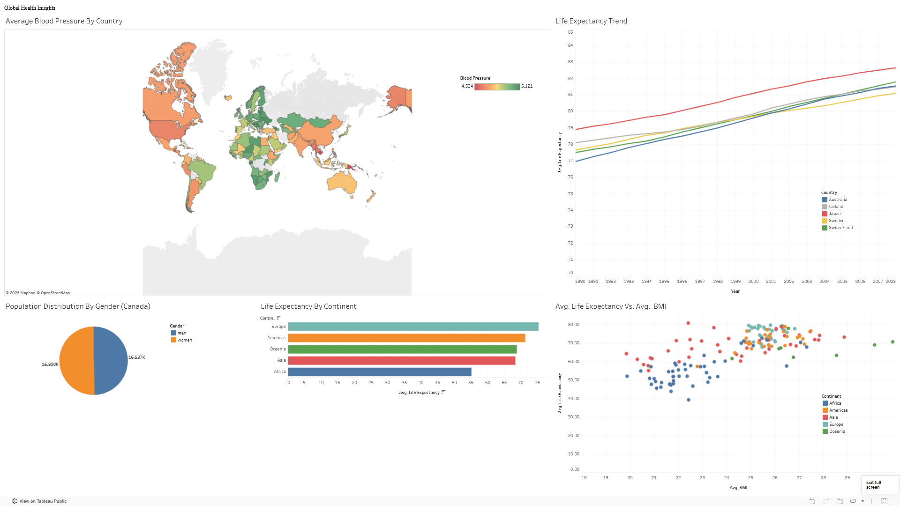
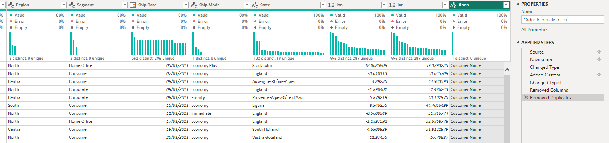
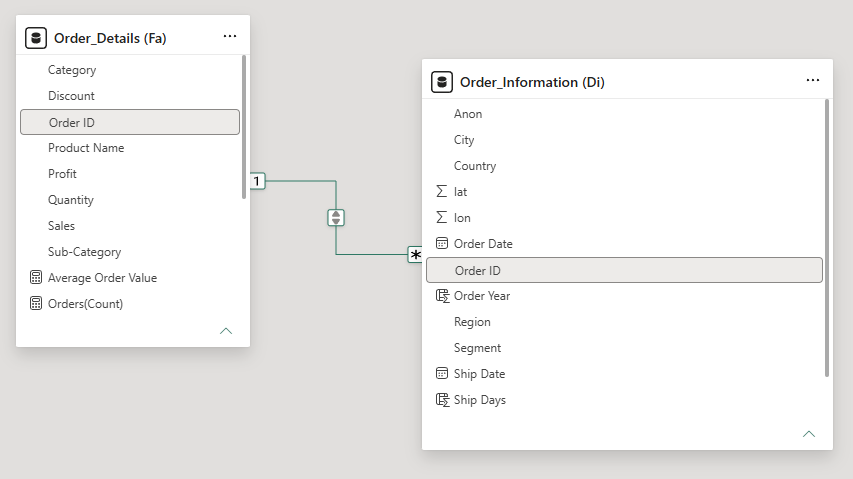
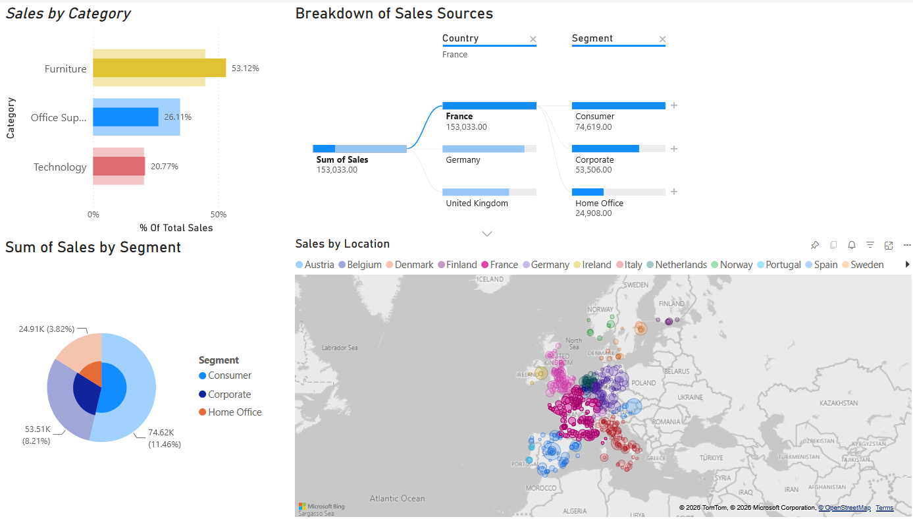

 
# Ryan Johns, Data Analyst Portfolio
Having originally studied a HNC in Computing at Bedford College, I decided to focus my learning into Data Analysis to further develop my skills in a growing and challenging industry. Below you will find a variety of projects that I have completed as part of my Data Analyst training course, as well as any side projects I have done for my own personal knowledge or interest.

For contact details and further career information, you can find my Linkedin page here: [Ryan Johns](https://www.linkedin.com/in/ryan-johns-da/)

---

### Trained in: 

- **Excel and data basics**: Manipulating, transforming and cleaning datasets in Excel, as well as creating PivotTables amd PivotCharts with interactive slicers.
- **Python via Google Colab**: Using Python code and NumPy to perform logic functions, Pandas for manipulation of dataframes and CSV files, and Matplotlib and Seaborn for Data Visualisation.
- **SQL / MySQL Workbench**: Creation and management of an SQL Database through Workbench, as well as running queries and transformations of data using SQL code. 
- **Tableau / Power BI dashboards**: Creating Visualisation of queries to answer questions about the data in a concise, easy to understand format.

 ---

### Training Projects:

---
### Excel
**Retail Sales Breakdown**  
*Using Targeted Analytics to Understand Customer Trends*  
Using the a retail sales dataset, we have a collection of listed sales for customers of a range of ages, across three different categories of product. Here, using a combination of conditional formatting and a SumIf statement, we are able to see the highest and lowest selling product categories across each age range, as well as the total sales figure from those categories. This would allow us to more directly promote specific products to specific age ranges, as we can tell they are more popular for that group.

For creating these tables and formatting, there are a few steps I needed to take first before even beginning with the end product.:
- Uploaded the raw dataset to be organised and cleaned.
- Formatted the dataset into a table for easier control.
- Checked data types are appropriate for each column, especially on number columns, as if no calculations are needed, they need to be formatted as text to avoid any problems.
- Checked for any duplicates or Null values, or any spelling errors causing multiple instances of the same value.
- Created a new column for arranging Customer ages by a range rather than individual number values, using an IF statement.
- Created a SumIf statement based on new age range column and product categorie sales.

 

As well, making use of Excel PivotTables, PivotCharts and Slicers, we can incorporate visualisations for a wide selection of data, then use the built-in tools to drill down to specific criteria that we might want to investigate. For instance, we can see that Young Adult Male's are most predominantly buying clothing items, followed closely by Beauty products. However, changing the age range to Senior shows a dramatic increase in the purchase of Electronics over clothing and beauty. 

The slicers created allow us to filter these charts based on:
- Age Range
- Category of Item Sold
- Gender

---

### Tableau  
**Global Health Insights** 
*A Visual Summary of World Health*  

With this project, I have created a variety of different visualisations using Tableau to give an easily understood summary of different trends relating to global health statistics. Using datasets like this can give a good general understanding of certain aspects of life and health in different parts of the world, without having to go into deep research on each area directly. 

Using Tableau we were able to inspect and clean a large dataset for our use. With Tableau's expanded ability to to create a wide variety of different visuals to help better understand this data, we have a lot more options in how we can display it. With graphs displaying information such as life expectancy per continent and the top 5 countries with the highest average life expectancy over a 20 year timeframe, we can use these graphs to start drawing conclusions or points for further analysis.

Similarly to with Excel, we have a set process for creating these types of Charts and Graphs:
- Importing the raw dataset, containing 6000+ records
- Cleaning the dataset and checking for any issues with datatypes
- Deciding on what columns of information to analyse
- Created a Line Graph, showing the change in top 5 countries with the highest average life expectancy over a 20 year timeframe
- Created a Bar Chart, showing the average life expectancy per continent.
- Created a Pie Chart, showing the Gender ratio of a specific country.
- Created a Scatter Graph, showing the relation between average BMI in countries Vs. their average life expectancy.
- Created a Geographical Heat Map, showing the average blood pressure per country via a colour gradient
- Arranged all the created charts into one single, unified dashboard.

With the use of a dashboard, we have the entire summary of work all in one place, allowing for quick understanding of the required information. The dashboard is also live, meaning that any changes or updates made to the dataset will still be reflected in the visuals without needing to alter them. We can also add new data into the source if needed, to further develop the range that it covers.

You can access the live dashboard here now: [Live Global Health Dashboard](https://public.tableau.com/views/GlobalHealthInsights_17803264327980/Dashboard1?:language=en-GB&:sid=&:redirect=auth&:display_count=n&:origin=viz_share_link)

The specific difficulties with this dataset came more from deciding on the best method to display the data. Even after choosing what type of graph or chart would be best to showcase the desired analysis, each axis needs to be looked at in terms of how to interpret the data being used. While an average can be used in a majority of cases, there are several as well that requrie a total sum instead, and deciding how and when to use these particular types of filters can massively change how the data is represented.

---

### Power Bi  
**European Sales Figures** 
*Exploring Relational Databases through Power Bi Visuals*  

Here, we have a collection of sales data covering the entirety of Europe, for furniture, technology and office supplies. We also have a much broader range of details compared to our porevious sets, now including map data for specific cities through longitude and latitude coordinates, as well as further details on the particulars of the sale itself, such as any discounts being applied per sale, or the shipping date and method. 

Compared to Excel and Tableau, we now clean and transform a lot of our data using Power Query, as it allows a much more thorough and in-depth understanding of the quality of our data prior to importing it into Power Bi and creating our relationships. We also start to implement methods of anonymising specific data, such as removing the details of the "Customer Name" column here, as it is unnecessary for our analysis and contains sensitive customer information.

Once cleaned, we now have the dataset in Power Bi itself, and need to set up the relationships to link the different tables. Without them, we would only ever be referencing one single table at a time, and the options we have for analysis are very limited. Linknig these two via their shared Order_ID means that we can use the combiend sets of data without actually combining them, keeping each tables purpose clear while still allowing us a thorough analysis. This is an example of a 1-to-many relationship, with their only ever being 1 specific order ID in the Order_details table, but the potential for multiple in Order_Information, where we can use it to reference the multiple different details kept in the Information tables columns.

With the relationships set, we can now start analysing specific parts of the data using visualisations. As this is obviously a sales dataset, we want to analyse the different aspects that affect those sales. The two keys to this dashboard are the decomposition tree and the Geographic breakdown. Not only do these give a good understanding of specific regions themselves, they can also be used to inspect particular countries, which will adjust the bar and pie chart to give more detailed information for that region. We can also see on the map where the higher concentration of sales are in each region based on the size of the circles, showing our most frequent customer areas more easily.

Similar to Tableau, there is a live representation of the data, availabe here: [Live Sales Data Dashboard](https://app.powerbi.com/groups/me/reports/512b7816-5fa6-4572-87ad-6f32f802d764/b91c20d19db3bb06e33e?experience=power-bi)

  

---

### SQL/MySQL Workbench  
**Database Design** 
*Building a Relational Database for a Business*  

---

- [Python] 
