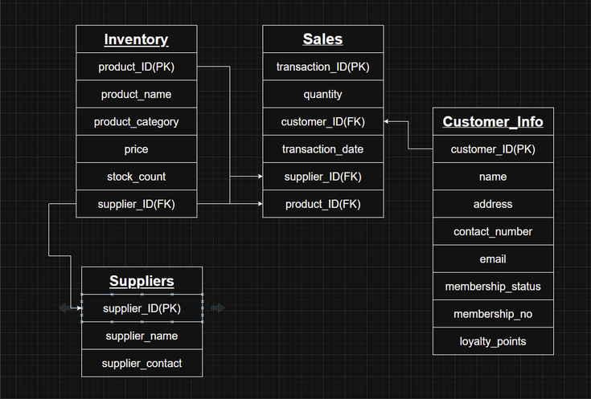

# SQL/MySQL Workbench
## [Return to Main Page](/README.md)
**Database Design** 
*Building a Relational Database for a Business*  

With SQL, we have access to one of the best industry standards in database creation and management. As such, we have created a scenario to help us explore the software.

- *You have been hired by a small retail business that wants to streamline its operations by creating a new database system. This database will be used to manage inventory, sales, and customer information. The business is a small corner shop that sells a range of groceries and domestic products. They also have a loyalty program, which you will need to consider when deciding what tables to create.*

With these details, we now know the basics of the information we will need to store, and can start building a basic Entity Relationship Diagram (ERD) to explain each tables headings, datatypes and relationships.

  

 With the ERD designed, we can start to write the code to create the tables, as well as defining the relationships through the primary and foreign keys.
